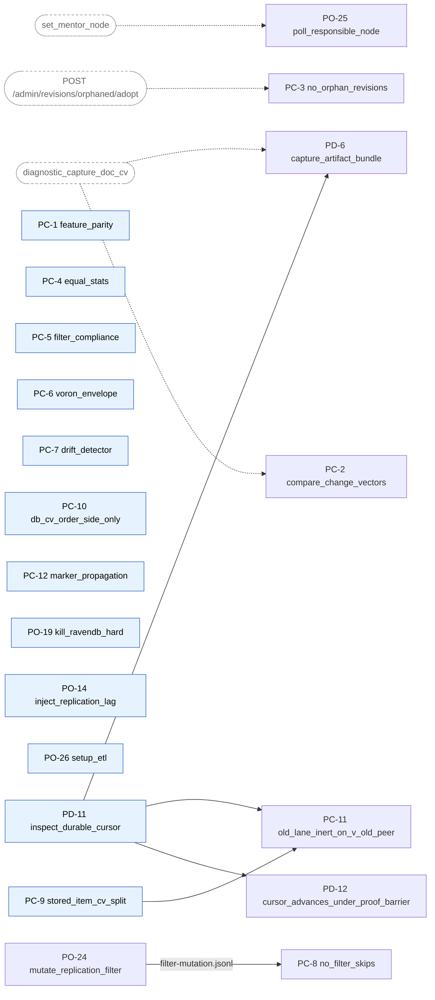

# company-1 Testing Plan — Proposed Toolbox Primitives

The catalog in [primitives.md](primitives.md) lists every primitive by name + one-line description. This file is the **spec sheet** for primitives that do not yet exist plus the implementation contract for each. Each entry: status, purpose, parameters, why-needed, and a **Pseudo-impl** block that pins the orchestration-side flow (endpoints called, payload checks, return tags).

Recipes in [scenarios.md](scenarios.md) and [soak.md](soak.md) describe steps in plain operational language and do not invoke primitives by name. This file is the contract the orchestration-layer implementor builds against.

## Status legend

| Tag | Meaning |
|---|---|
| **NEW** | To be implemented. Pseudo-impl below is the contract. |
| **DEFERRED** | Out of scope for this PR; kept on the list for a later session. |

Every NEW primitive lives on endpoints that already exist in the branch — no new product surface is required for this PR.

---

## Primitive specs

### PC-1 — `assert_node_and_feature_parity`

**Status.** NEW.

**Purpose.** Confirm every node in a cluster reports a consistent binary identity and `DatabaseRecord.SupportedFeatures`. Mixed binaries only allowed during a rolling upgrade window.

**Parameters.** `cluster_leader`, `db_name`, `expected_build` (optional pin, e.g. `v_new`), `allow_mixed` (bool, default false).

**Inputs (existing product surfaces).**
- **`GET /build/version`** per node (returns `{BuildVersion, ProductVersion, CommitHash, FullVersion}`).
- **`GET /admin/databases?name=<db>`** → `DatabaseRecord.SupportedFeatures` (cluster-wide, single-valued).

**Why needed.** I-10 invariant. Used by RV-1, RV-2, RPV-1, SK-2.

**Pseudo-impl.**
```
1. GET <leader>/cluster/topology  → [{NodeTag, NodeUrl}]
2. For each node:
     GET <NodeUrl>/build/version  → ProductVersion
3. GET <leader>/admin/databases?name=<db>  → DatabaseRecord.SupportedFeatures
4. Assert:
     allow_mixed=false → all ProductVersions equal expected_build (if pinned)
     allow_mixed=true  → all ProductVersions ∈ expected version pair
     SupportedFeatures equals expected_post_upgrade_set
5. Return OK | CORRUPT(mixed_when_not_allowed) | STUCK(unreachable_nodes)
```

---

### PC-2 — `compare_change_vectors`

**Status.** NEW (consumes the existing `diagnostic_capture_doc_cv.yml` capture).

**Purpose.** For every doc in a set, fetch the **per-doc CV** (from `@metadata.@change-vector`) on each target node and assert equality as a multiset of `(sourceTag, etag)` pairs.

**Parameters.** `db_name`, `targets` (list of node tags), `doc_ids_prefix` OR `doc_ids_list`, `budget_secs` (default 60).

**Why needed.** I-2 (CV); the load-bearing convergence assertion. A count match with mismatched CVs is silent corruption — node A has `[rev1, rev2]`, node B has `[rev1, rev3]`. Same count, different content. Aggregate-count parity (PC-4) doesn't catch it; PC-2 (per-doc CV multiset) does.

**Scale concern.** `diagnostic_capture_doc_cv.yml` writes one file per (doc × node). At 50k docs × 9 nodes = 450k files per capture — untenable at scenario scale. Mitigation: PC-2 default mode operates on a **deterministic sampled subset** (e.g. 500 docs) plus the full conflicted-doc set when applicable. Full enumeration runs only on forensic capture after CORRUPT.

**Pseudo-impl.**
```
1. Choose probe set:
     - workload_trace[doc_ids] sampled deterministically (default 500), OR
     - explicit list passed in by caller (e.g. RP-2 conflicted set)
2. ansible-playbook toolbox/diagnostic/diagnostic_capture_doc_cv.yml \
       -e db_name=<db> -e '{"ids":[...], "nodes":[targets]}' \
       -e output_dir=captures/<scenario>-<ts>/
3. NEW post-processor (toolbox/diagnostic/lib/compare_cv.py or sibling playbook):
   - parse each <docId>__<nodeTag>.cv  → multiset of (sourceTag, etag)
   - per docId: assert multiset equality across nodes
4. Return OK | LAG (retry once) | CORRUPT(diff_doc_ids_with_per_node_cv)
```

---

### PC-3 — `assert_no_orphan_revisions`

**Status.** NEW. The existing endpoint **`POST /databases/{db}/admin/revisions/orphaned/adopt`** is the trigger.

**Purpose.** Trigger the engine's revisions-adopt path and assert zero adoptions occur. If an orphan existed, the adopt would attach it to a synthetic parent or surface it; a clean zero confirms no orphans.

**Parameters.** `db_name`, `targets`, `budget_secs` (default 60).

**Why needed.** I-4; R-01 risk.

**Endpoint details.**
- Handler: `AdminRevisionsHandler.cs:38–43`.
- Returns `AdoptOrphanedRevisionsResult` with `AdoptedCount`, `ScannedDocuments`, `ScannedRevisions`, `LastProcessedEtags`, `EtagBarriersUsed`.
- Operation is async — returns an `OperationId`; poll until `Completed`.

**Pseudo-impl.**
```
For each target node:
  1. POST <node>/databases/<db>/admin/revisions/orphaned/adopt  → OperationId
  2. Poll GET <node>/databases/<db>/operations/state?id=<op>
       until Status == Completed (within budget_secs) | Faulted
  3. Parse Result → AdoptOrphanedRevisionsResult
  4. assert AdoptedCount == 0
Return OK | LAG (extend once) | CORRUPT({node, adopted_count, scanned_docs, scanned_revs})
```

---

### PC-4 — `assert_equal_stats`

**Status.** NEW — aggregate form via existing `/stats` endpoint (per-doc form reserved for forensic capture).

**Purpose.** Assert non-revision per-database stat aggregates are equal across nodes.

**Parameters.** `db_name`, `targets`, `aspects` (subset of `[attachments, counters, timeseries]`; default = all).

**Why needed.** I-2 (consolidated content parity). Used by RPV-2, SK-1 (W-2 windows).

**Pseudo-impl.**
```
1. For each target: GET /databases/<db>/stats  → stats[node]
2. Compare across nodes (per requested aspect):
     attachments  → CountOfUniqueAttachments, CountOfAttachments
     counters     → CountOfCounterEntries
     timeseries   → CountOfTimeSeriesSegments
3. Return OK | LAG (retry once within budget) | CORRUPT(per_field_delta_per_node)

Forensic mode (on CORRUPT, runs once):
4. For each docId in workload trace:
     /docs?id  → @metadata.@attachments[].Hash,Size  per node
     /counters?docId&full=true  → per-node counter values
     /timeseries/ranges?docId&name=*  → segment-hash sequence
   Append per-doc divergence detail to artifacts.
```

---

### PC-5 — `assert_filter_compliance`

**Status.** NEW.

**Purpose.** Sink-side check: every doc on the sink matches the configured allowed-paths filter spec. Catches the "leak" direction of I-7.

**Parameters.** `sink_cluster_leader`, `db_name`.

**Why needed.** I-7 (leak side).

**Pseudo-impl.**
```
1. GET <sink_leader>/admin/databases?name=<db>  → DatabaseRecord
   Extract PullReplicationAsSink[].AllowedPathsPrefixes  (and AllowedPaths)
2. Enumerate every doc on the sink:
     GET /databases/<db>/streams/docs?startsWith=*  (paged)
     OR  per-collection enumeration if streams/docs not viable at scale
3. For each docId:
     assert at least one (prefix in AllowedPathsPrefixes matches docId)
            OR docId in AllowedPaths
4. Return OK | CORRUPT(leak_ids[])
```

---

### PC-6 — `voron_growth_envelope`

**Status.** NEW — whole-database envelope via `/stats.SizeOnDisk`.

**Purpose.** Whole-database storage envelope. Catch egregious bloat.

**Parameters.** `target`, `db_name`, `baseline_artifact`, `max_growth_pct` (default 50 — coarse).

**Why needed.** I-8.

**Pseudo-impl.**
```
1. GET /databases/<db>/stats  → SizeOnDisk + TempBuffersSizeOnDisk
2. Load baseline_artifact  → baseline_size
3. growth_pct = (now_size - baseline_size) / baseline_size × 100
4. assert growth_pct ≤ max_growth_pct
5. Return OK | CORRUPT(now_size, baseline_size, pct)
```

---

### PC-7 — `drift_detector`

**Status.** NEW.

**Purpose.** Background watchdog during soaks. Halts the scenario on monotonic-growth-without-proportional-workload-growth — the alarm for slow leaks that would otherwise pass quiescence checks but accumulate over hours.

**Parameters.** `db_name`, `targets_all`, `snapshot_interval_secs` (default 300), `window_minutes` (default 15 for 2 h soaks), `backlog_ceiling` (default 50000).

**Why needed.** I-9.

**What it does in plain English.** Every 5 min: snapshot three numbers per node — replication-backlog size, revision count (`/stats`), and workload writes since last snapshot (from trace). Over each rolling 15-min window: if **backlog strictly increasing AND revisions growing AND workload_writes < growth × 0.5**, halt the run with CORRUPT. Catches the failure mode where the scenario looks fine at every individual quiescence checkpoint but is bleeding state in between.

**Pseudo-impl.**
```
loop (lifetime = scenario, run as a background Ansible job):
  every snapshot_interval_secs:
    snapshot = {
      ts: now(),
      backlog_per_pair: from /replication/active-connections per node,
      count_of_revisions_per_node: from /stats per node (CountOfRevisionDocuments),
      workload_writes_in_window: from artifacts/<scenario>/workload-trace.jsonl
    }
    append snapshot → artifacts/<scenario>/drift.jsonl

  every window_minutes (sliding):
    last3 = last 3 snapshots in the window
    if backlog strictly increasing across last3
       AND revisions count strictly increasing across last3
       AND workload_writes_in_window < (revision_growth × 0.5):
         HALT scenario; tag CORRUPT
         dump artifacts/<scenario>/drift-halt.json with the trip evidence
```

**Implementation-confirm.** A *planned* recovery — a partitioned/removed sink rejoining and replaying its backlog — produces exactly the backlog-then-drain spike this loop watches for. The detector must not false-halt on it: suppress (or open a wider window for) the monotonic-growth alarm during known recovery windows (post-heal, post-rejoin, post-partition), and re-arm only once drain completes. The exact mechanism (caller-signalled recovery window vs. detector-side drain heuristic) is an open design point — confirm before the soaks run.

---

### PO-24 — `mutate_replication_filter`

**Status.** NEW.

**Purpose.** Change the filter spec (allowed paths) for an existing hub-sink replication task. Supports pull and push, hub-side and sink-side directions. Logs the mutation timestamp for downstream projection.

**Parameters.** `hub_cluster_leader`, `sink_cluster_leader`, `db_name`, `direction` (`pull` / `push` / `sink-to-hub`), `new_allowed_paths` (JSON list).

**Why needed.** Central RP-2 phase (b) enabler.

**Pseudo-impl.**
```
1. GET <hub_leader>/admin/databases?name=<db>  → DatabaseRecord
2. Locate the matching task definition by direction:
     hub-side  → PullReplicationDefinitions[]
     sink-side → PullReplicationAsSink[] entries
3. Modify AllowedPathsPrefixes (and/or AllowedPaths); preserve TaskId
4. POST appropriate update endpoint:
     hub  → /admin/tasks/pull-replication/hub
     sink → /admin/tasks/sink-pull-replication
   with the modified definition.
5. Append {t: now(), direction, new_spec} → artifacts/<scenario>/filter-mutation.jsonl
   (consumed by PC-8's projection helper)
6. Return OK | CORRUPT(verify_step_failed)
```

---

### PO-25 — `poll_responsible_node`

**Status.** NEW — observe-only. RavenDB has no "move replication task" verb; the cluster picks `ResponsibleNode` from topology and mentor preference. PO-25 polls until the responsible node reflects an expected value (typically after `set_mentor_node` has been called separately).

**Purpose.** Block until the responsible node of a replication task equals an expected tag, or budget out.

**Parameters.** `cluster_leader`, `db_name`, `task_name`, `expected_tag`, `budget_secs` (default 60).

**Why needed.** SK-1 task-movement coverage reduces to "mentor change + responsible-node poll." Use after `set_mentor_node` to confirm ownership flipped.

**Pseudo-impl.**
```
1. Locate TaskId via GET /databases/<db>/tasks  (match by Name + Kind)
2. Loop until budget exhausted:
     GET /databases/<db>/tasks
     find entry by TaskId; read ResponsibleNode.NodeTag
     if NodeTag == expected_tag: break (OK)
     sleep poll_interval_secs (default 2)
3. Return OK | STUCK(current_responsible_node)
```

---

### PO-26 — `setup_etl`

**Status.** NEW.

**Purpose.** Configure a RavenETL task between two databases.

**Parameters.** `source_cluster_leader`, `source_db`, `dest_cluster_leader`, `dest_db`, `connection_string_name`, `script` (optional; default revisions-aware passthrough).

**Why needed.** RV-3 (ETL is only in the extended sharded scenario).

**Pseudo-impl.**
```
1. POST <source_leader>/admin/connection-strings
     body: {Name, TopologyDiscoveryUrls:[<dest_url>],
            Database: <dest_db>, Type: "Raven"}
2. POST <source_leader>/admin/etl
     body: {ConnectionStringName, Transforms:[{Collections, Script}], MentorNode}
3. wait/wait_for_quiescence.yml -e db_name=<dest_db> on dest
   to confirm ETL caught up
4. Return OK | CORRUPT(task_not_active)
```

---

### PO-19 — `kill_ravendb_hard`

**Status.** NEW.

**Purpose.** SIGKILL the RavenDB process on a target. Ungraceful kill, distinct from `restart_ravendb`'s graceful stop + start.

**Parameters.** `target`.

**Why needed.** RP-2 phase (c) leader kill, RPV-2 round-2 phase-(a) failover, RP-3, SK-1.

**Pseudo-impl.**
```
1. docker exec <target> sh -c "kill -9 $(pidof Raven.Server)"
   (SSH mode: ansible <target> -a "kill -9 $(pidof Raven.Server)" -b)
2. Return immediately. Caller invokes wait_for_member separately.
```

---

### PO-14 — `inject_replication_lag`

**Status.** NEW — port-filtered (delays only the cluster TCP port, not HTTPS client writes).

**Purpose.** Add deterministic egress delay to a node's outbound replication-only traffic. HTTPS writer traffic is untouched.

**Parameters.** `target`, `delay_ms`, `cluster_tcp_port` (default from `group_vars` — typically 38888).

**Companion.** `clear_replication_lag` (sibling — flushes qdisc).

**Why needed.** RP-2 phase (b) out-of-order injection sub-phase.

**Pseudo-impl.**
```
1. Build a tc class hierarchy that delays only the cluster TCP port:
     docker exec <target> tc qdisc add dev eth0 root handle 1: prio
     docker exec <target> tc qdisc add dev eth0 parent 1:3 handle 30: \
         netem delay <delay_ms>ms
     docker exec <target> tc filter add dev eth0 protocol ip parent 1:0 prio 3 \
         u32 match ip dport <cluster_tcp_port> 0xffff flowid 1:3
2. Clear (companion playbook):
     docker exec <target> tc qdisc del dev eth0 root
```

---

### PC-8 — `assert_no_filter_skips`

**Status.** NEW — count-parity form (per-doc set membership reserved for forensic capture).

**Purpose.** Observable-layer check — every source doc matching the active filter spec at write time should land on the sink after a replication-quiet. Catches the explicit "documents silently dropped" regression at the count level.

**Parameters.** `hub_cluster_leader`, `sink_cluster_leader`, `db_name`, `filter_spec` (current; can be queried if omitted).

**Why needed.** I-7 (skip side). Observable-effect complement to PC-10's CV-shape regression guard.

**Pseudo-impl.**
```
For static-filter scenarios (RP-1, RPV-2 phase a):
  1. EXPECTED_COUNT = workload_trace docs whose docId matches current filter
  2. ACTUAL_COUNT = GET /databases/<db>/stats on sink → CountOfDocuments
                    (or per-prefix collection-stats for filtered sinks)
  3. assert ACTUAL_COUNT == EXPECTED_COUNT
  4. Return OK | CORRUPT(actual, expected, delta)

For mutating-filter scenarios (SK-1 phase b, RP-2 phase b):
  1. Run sink_projection.py against workload_trace + filter-mutation.jsonl:
       for each (docId, writeTime):
         active_spec = latest (t, spec) with t ≤ writeTime
         expected_on_sink[docId] = active_spec.admits(docId)
     EXPECTED_COUNT = |{docId : expected_on_sink}|
  2-4. As above.

On CORRUPT (forensic):
  5. Re-run with set membership to identify missing docIds.
     Append to artifacts/<scenario>/filter-skip-forensic.json.
```

**Helper.** `company-1_TESTING_PLAN/tools/sink_projection.py` — pure Python; consumes workload-trace JSONL + filter-mutation JSONL; outputs the count (and on forensic, the set).

---

### PC-9 — `assert_stored_item_cv_split`

**Status.** NEW — covers **all replication-item families** via the existing `debug/replication/all-items` enumeration. No per-family bespoke surface needed.

**Purpose.** On a v_new receiver after a filtered pull batch from a v_new sender, assert every received item's stored CV is correctly shaped for the new lane (split `Order|Version` form).

**Parameters.** `db_name`, `target` (receiver node tag), `item_families` (JSON list to restrict the check; default = every family the enumeration returns — `document, document_tombstone, conflict_document, revision_document, revision_tombstone, attachment_metadata, attachment_stream, attachment_tombstone, counter_group, time_series_segment, deleted_time_series_range, legacy_counter`), `start_etag` (default 0), `page_size` (default 1024), `max_etag` (optional — bounds the scan to a seeded probe range so a full-store scan isn't forced at scale).

**Returns.** Per item: `{id, family, stored_cv, parsed_order, parsed_version, shape_ok}`.

**Why needed.** I-13 parts (a) single-node receiver and (c) across receiver-group replicas, in one primitive — caller passes a single tag for the leader-only check or the full receiver-group set for the second-hop sub-check. Anchors RP-1.

**Pseudo-impl.**
```
1. cursor = start_etag
2. Loop (paged):
     GET <target>/databases/<db>/debug/replication/all-items?etag=<cursor>&pageSize=<page_size>
        → items[]  (each carries Type/family, Id, ChangeVector)
     break if items empty, or if last item's etag > max_etag (when set)
     for each item whose family ∈ item_families:
       parse ChangeVector: split on the `|` delimiter into (order_side, version_side).
         The pipe appears ONLY in a compound (new-lane) CV, so the split is
         unambiguous — a legacy / raw CV contains no pipe (a raw CV → not split-shaped).
       shape_ok = order_side non-empty AND version_side non-empty
                  AND every entry well-formed
       record {id, family, stored_cv, parsed_order, parsed_version, shape_ok}
     cursor = last item's etag + 1
3. Tag CORRUPT if any shape_ok == false; else OK.

Scale note: bound the scan with max_etag (or a seeded probe range) on large stores.
RP-1's per-family inventory is small and bounded, so a full paged scan is cheap there.
```

---

### PC-10 — `assert_db_cv_order_side_only`

**Status.** NEW — **the load-bearing CV-boundary regression guard**.

**Purpose.** On a v_new receiver, `LastDatabaseChangeVector` contains only receiver-group node entries — no source-side leakage from filtered ingress.

**Parameters.** `cluster_leader` (receiver), `db_name`, `receiver_group_tags` (set of node tags belonging to the receiver group, e.g. `[SA, SB, SC]`), `forbidden_source_tags` (optional explicit set; if omitted, anything outside `receiver_group_tags` is forbidden).

**Returns.** `OK` if every entry's node tag ∈ `receiver_group_tags`; `CORRUPT` (with offending entries listed) otherwise.

**Why needed.** I-13; the load-bearing regression guard for RP-1.

**Pseudo-impl.**
```
1. For each node in receiver_group_tags:
     GET <node>/databases/<db>/stats  → DatabaseChangeVector (string)
2. Parse: split into entries; each entry is "<tag>:<etag>-<dbId>"
3. For each entry:
     extract tag
     assert tag ∈ receiver_group_tags
            (if forbidden_source_tags supplied, also assert tag ∉ that set)
4. Aggregate violations across receiver-group nodes.
5. Return OK | CORRUPT([{node, offending_entries}])
```

---

### PD-11 — `inspect_durable_cursor`

**Status.** NEW — **read surface still TBD.** The durable Sink-owned failover cursor is part of the `v_new` work; a codebase search found the `replication-source-cursor` record only in this plan, not yet in product code, so where/how it is persisted is not confirmed. The only read-by-key HTTP surface that exists today is **compare-exchange** (`GET /databases/{db}/cmpxchg?key=<key>`, handler `CompareExchangeHandler.GetCompareExchangeValues`, returns `{Key, Value, Index}`) — so *if* the cursor is persisted as a compare-exchange value, PD-11 reads it there (the proposed key's `values/...` prefix hints at this). If it lands in raw cluster state instead, a dedicated single-key read endpoint must be added (none exists today). **Confirm against the `v_new` implementation before building PD-11.**

**Purpose.** Read the Sink-owned durable failover-cursor record by key. Returns key, value, raft index. Supports multi-poll for compare-and-advance verification.

**Parameters.** `sink_cluster_leader`, `sink_db_name`, `sink_task_id`, `direction` (`hub-to-sink` or `sink-to-hub`), `poll_count` (default 1).

**Returns.** `[{ts, key, value_cv, raft_index}]` ordered by observation time.

**Why needed.** I-12; anchors RP-3 phases (a)..(f).

**Pseudo-impl.**
```
1. key = "<sink_db_name>/replication-source-cursor/<sink_db_group_id>/<sink_task_id>/<direction>"
2. Loop poll_count times:
     GET <sink_leader>/databases/<sink_db_name>/cmpxchg?key=<key>
        → {Key, Value, Index}     (compare-exchange read; cluster-store-backed)
     parse Value → the cursor's stored change vector
     append {ts: now(), key, value_cv: parsed, raft_index: Index}
     sleep poll_interval_secs between iterations
3. Return list ordered by ts.
```

---

### PD-12 — `assert_cursor_advances_under_proof_barrier`

**Status.** NEW. Reuses PD-11 + `/stats`.

**Purpose.** The durable cursor advances only after the receiver-local proof barrier is covered (last applied receiver etag for mutation batches; current DB etag for no-mutation completed scans). Disposed handlers cannot write late durable advances.

**Parameters.** `sink_cluster_leader`, `sink_db_name`, `sink_task_id`, `direction`, `proof_barrier_etag` (receiver etag the cursor should be gated on), `expected_value_cv`.

**Returns.** `{pre_barrier_cursor, post_barrier_cursor, advanced_correctly: bool, reason}`.

**Why needed.** I-12; anchors RP-3 phases (b), (d), (f).

**Pseudo-impl.**
```
1. pre_barrier_cursor = PD-11 read once
2. Poll GET /databases/<db>/stats on receiver
     until LastDocEtag >= proof_barrier_etag
3. post_barrier_cursor = PD-11 read once
4. advanced_correctly =
     (pre_barrier_cursor != post_barrier_cursor)
     AND (post_barrier_cursor.value_cv == expected_value_cv)
5. Reason populated on failure (e.g. "advanced before barrier",
                                       "did not advance after barrier",
                                       "advanced to wrong CV").
6. Return OK | CORRUPT(advanced_correctly=false, reason)
```

---

### PC-11 — `assert_old_lane_inert_on_v_old_peer`

**Status.** NEW. Reuses PC-9 (inert-check mode on the document family) + PD-11 (cursor record absence).

**Purpose.** When a v_new node connects to a v_62 peer, the new lane stays inert — no new-lane artifacts (split-shape item CVs, durable cursor records) appear on the v_new side.

**Parameters.** `cluster_leader`, `db_name`, `task_id`, `v_new_node_tags` (nodes whose stored state to inspect).

**Returns.** `{any_split_cv_items: bool, cursor_records:[...], passes: bool, evidence}`.

**Why needed.** Anchors RPV-1 and RV-2 — proves the v_new code stays compatible against an old peer without producing durable artifacts of the new behavior.

**Pseudo-impl.**
```
1. For each node in v_new_node_tags:
     Run PC-9 in "inert-check" mode against documents whose source is the v_62 peer
       any_split_cv_items = true if ANY returned item has stored_cv with the
                            split shape (Order|Version delimiter) — that's a failure.
2. Run PD-11 for direction matching this peer:
     cursor_records = result
     expected: empty (no cursor records written against a v_62 peer).
3. passes = (any_split_cv_items == false) AND (len(cursor_records) == 0)
4. Return OK if passes, else CORRUPT with the evidence dict.
```

---

### PC-12 — `assert_marker_propagation`

**Status.** NEW.

**Purpose.** End-to-end "replication is flowing" check. Write a uniquely-IDed sentinel doc on the source, poll every replication destination until the marker appears (within budget). The validator for I-5.

**Parameters.** `source_cluster_leader`, `db_name`, `targets` (list of `{cluster_leader, node_tag}` pairs to poll), `marker_id_prefix` (default `markers/`), `budget_secs` (default 60), `must_match_filter` (bool, default true — when the source-target leg is filtered, the marker ID is chosen to match the active filter spec).

**Why needed.** I-5. Used at every quiescence checkpoint and after every chaos heal.

**Pseudo-impl.**
```
1. marker_id = "<marker_id_prefix><scenario>-<ts>-<rand>"
   When must_match_filter: pick prefix so that marker_id is admitted by
   every target leg's filter spec (queried from each target's DatabaseRecord).
2. PUT <source_leader>/databases/<db>/docs?id=<marker_id>
     body: {"@metadata": {"@collection": "Markers"}, "ts": <iso>}
3. For each (cluster_leader, node_tag) in targets, in parallel:
     Loop until budget exhausted:
       GET <cluster_leader>/databases/<db>/docs?id=<marker_id>
         (route via node_tag via topology / direct URL)
       if 200 with matching ts → mark target OK and break
       else sleep poll_interval_secs (default 1)
4. Return OK if every target observed the marker within budget
          | STUCK(targets_that_did_not_observe)
5. Optional cleanup: DELETE the marker (caller decides; defaults to keep
   so subsequent forensic captures can correlate).
```

---

### PD-6 — `capture_artifact_bundle`

**Status.** NEW.

**Purpose.** Single primitive that captures the forensic-artifact bundle at a scenario checkpoint. Scenarios invoke it after every checkpoint, after every chaos step, and on validator failure. One call replaces eight ad-hoc curls per checkpoint.

**Parameters.** `db_name`, `nodes` (optional — auto-discover from topology), `output_dir` (default `artifacts/<scenario>/<ts>/`), `include` (subset of the artifact list; default = all in-scope), `sample_doc_ids` (optional — passed through to `diagnostic_capture_doc_cv`), `sink_task_id` (optional — passed through to PD-11), `forensic` (bool, default false — when true, also collects server logs).

**Returns.** Path to the bundle directory + count of artifacts written.

**When to invoke.**
- After provisioning (T0 baseline).
- After the initial seed.
- After each chaos step.
- After `wait_for_quiescence` at every checkpoint.
- On any validator failure — set `forensic=true` to include server logs.
- Soak: every 5 min snapshot of `stats.json` + `replication.json` only (drift-detector input) — invoke with `include=[stats, replication]`.

**Artifacts written.**

| File | Source | Purpose |
|---|---|---|
| `stats-<node>.json` per node | `GET /databases/<db>/stats` | Counts, etag floor, `SizeOnDisk` |
| `replication-<node>.json` per node | `GET /databases/<db>/replication/active-connections` + `GET /databases/<db>/replication/debug/outgoing-failures` | Backlog, mentor identity, reconnect failures |
| `topology-<cluster>.json` per cluster | `GET /cluster/topology` | Member / promotable / rehab |
| `database_record-<cluster>.json` per cluster | `GET /admin/databases?name=<db>` | Filter spec, replication-task state, `SupportedFeatures` |
| `cv-dump/...` per (db, node) | delegate to existing `toolbox/diagnostic/diagnostic_capture_doc_cv.yml` (only when `sample_doc_ids` is provided) | Per-doc CV snapshot for I-2 |
| `tombstones-<node>.json` per node | `GET /databases/<db>/admin/tombstones/state` | Documents / time-series / counters per collection |
| `cursor_state.json` per sink | delegate to PD-11 `inspect_durable_cursor` (only when `sink_task_id` is provided) | I-12 — durable failover-cursor record |
| `logs-<node>.tar` per node | `GET /admin/logs/download` | Server logs — collected only when `forensic=true` |

**Why needed.** Replaces the standalone "Observability requirements" cross-reference. Scenarios get a single one-liner at every checkpoint instead of repeated ad-hoc capture lists; validators read from a stable file layout.

**Pseudo-impl.**
```
1. ts = now()  ; output_dir = artifacts/<scenario>/<ts>/  ; mkdir -p
2. nodes = auto-discover from /cluster/topology (or use input list)
3. Per node, in parallel (respect include[]):
     GET /databases/<db>/stats → stats-<node>.json
     GET /replication/active-connections + outgoing-failures → replication-<node>.json
     GET /databases/<db>/admin/tombstones/state → tombstones-<node>.json
4. Per cluster (one node per cluster suffices for these):
     GET /cluster/topology → topology-<cluster>.json
     GET /admin/databases?name=<db> → database_record-<cluster>.json
5. If sample_doc_ids:
     invoke diagnostic_capture_doc_cv.yml -e ids=<...> -e output_dir=<output_dir>/cv-dump
6. If sink_task_id:
     invoke PD-11 once → cursor_state.json
7. If forensic:
     per node: GET /admin/logs/download → logs-<node>.tar
8. Return {output_dir, file_count}
```

---

## Composition recipes (no playbook)

No-product-change recipes that scenarios can name directly.

### Recipe: *Per-doc revision convergence*

> Run `PC-4` (aggregate count parity via `/stats`) + `PC-2` (per-doc CV multiset equality on a sampled probe set) over the same target nodes. Both passing = convergent. Either failing = the scenario fails at that specific aspect. Per-doc revision count parity has no scalable enumeration surface — when a scenario calls for it (e.g. RV-1 phase 4), use a sparse-sample composition: read the workload trace, pick a deterministic probe set, and compare per-doc revision counts from `/revisions?id=` against the trace expectation on every peer.

### Recipe: *Post-conflict convergence*

> Run `PC-2` on the W-5 conflicted-doc set (or whatever workload-trace marker identifies the conflicted IDs in the scenario). Then GET `/databases/<db>/replication/conflicts` on every node — must be empty. Both conditions = convergent. Conflicts auto-resolve via the configured resolver, so this is observation-only.

### Recipe: *Legacy-form revision seed*

> Use an older binary that natively writes raw-CV-form revisions. Composition:
> 1. `playbooks/install_ravendb.yml -e rdb_version=v_62` on the seeding node.
> 2. `toolbox/writes/write_docs.yml` against that node — revisions land in raw-CV form natively.
> 3. Either: `toolbox/service/upgrade_node.yml` to v_new (untouched raw-CV rows stay raw); OR wire replication from the older node to a v_new peer (the v_new receiver stores the wire-emitted raw-CV form as a legacy row).
> 4. Confirm the mixed-form state is in place by sampling per-doc revisions via `/revisions?id=` and checking field-12 presence on the returned items.
>
> Used by RPV-2, RV-1 phase 1, and any other "mixed-form initial state" setup.

---

## Dependency graph

Arrows mean "consumes the output of" or "reuses the logic of." Independent nodes can be implemented in any order. Dashed edges point at existing toolbox primitives that the new ones build on.



**Reading the graph:**

- **Independent nodes** (no incoming arrows): can land in any order. They each touch one existing product surface and run standalone — PC-1, PC-4, PC-5, PC-6, PC-7, PC-9, PC-10, PC-12, PO-14, PO-19, PO-26, PD-11.
- **Wrappers** (PC-2, PC-3, PO-25, PD-6): straight composition over an existing toolbox primitive. Cheap.
- **Output-consumer** (PC-8): consumes `filter-mutation.jsonl` produced by PO-24, so PO-24 must land first.
- **Reuse** (PD-12, PC-11, PD-6): call the logic of other NEW primitives directly; their parents must land first. PD-6 reuses PD-11 (cursor read) when the scenario has a sink task.
- **Composition recipes** (*Per-doc revision convergence*, *Post-conflict convergence*, *Legacy-form revision seed*): not in the graph — they're orchestration patterns, not playbooks.

**Critical path to RP-1 (the CV-boundary regression guard):** PC-10 alone. RP-1's full per-item coverage adds PC-9 (called once on the leader, then on the full receiver-group set for the second-hop sub-check).

**Critical path to RP-3 (failover cursor):** PD-11 → PD-12 + PC-11 (and PC-11 also needs PC-9).

**Critical path to RP-2 phase (b) (filter mutation under chaos):** PO-24 + PC-5 + PC-8 (in any order, PC-8 last because it consumes PO-24's log).

## Open items pending separate discussions

| # | Topic | Status |
|---|---|---|
| 1 | **PD-11 read surface (failover cursor)** — where the `v_new` branch persists the durable Sink-owned cursor, and therefore the read-by-key endpoint, is not yet confirmed (the record appears only in this plan, not yet in product code) | **OPEN / TBD.** Compare-exchange (`GET /databases/{db}/cmpxchg?key=`) is the only read-by-key HTTP surface today and is the leading candidate — confirm against the `v_new` implementation; if the cursor lives in raw cluster state, a new read endpoint is needed. Gates RP-3 (all 6 injection points), PD-12, PC-11, and the SK-1 / SK-2 cursor spot checks. |
| 2 | **Cross-version / mid-migration restore coverage (R-18)** — no scenario restores a `v_62`-era or mixed-form backup into a `v_new` cluster | Coverage gap, **not a blocker for starting**. Add a dedicated phase (e.g. an RPV-2 round that backs up on `v_62` and restores into `v_new`) before sign-off. |
| 3 | **Drift detector vs planned recovery (PC-7)** — after a planned partition / long-outage heals, backlog must spike during replay | The detector has to distinguish a planned post-heal catch-up from a real leak (suppress or window the monotonic-growth alarm during known recovery windows). Confirm the mechanism before the soaks run. |

**Resolved (no longer pending):**
- *CV-boundary bug repro / RP-1 workload* — RP-1 is a **happy-path coverage** scenario (clean all-v_new topology); it does not depend on the historical bug repro. Its workload is final. Negative/regression testing is a separate scenario outside this plan.
- *PC-9 non-document families* — resolved: `debug/replication/all-items` enumerates every family with its change vector, so PC-9 covers all item families via one paged scan.
- *Tombstone-resurrection risk* — dropped from the plan; RP-2 phase (d) is plain split-brain conflict convergence (I-11), no resurrection probe.
- *W-9 (re-attach touch storm)* — dropped; revisions are immutable, so re-adding identical attachment content doesn't force a rewrite. R-03 is exercised by the W-1 churn loop in RV-1 (new revisions on just-migrated docs).
